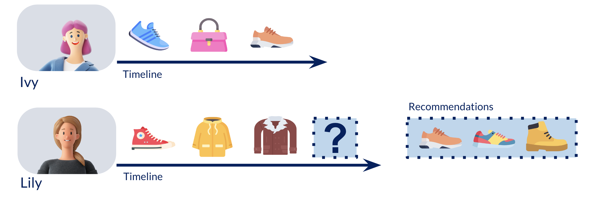
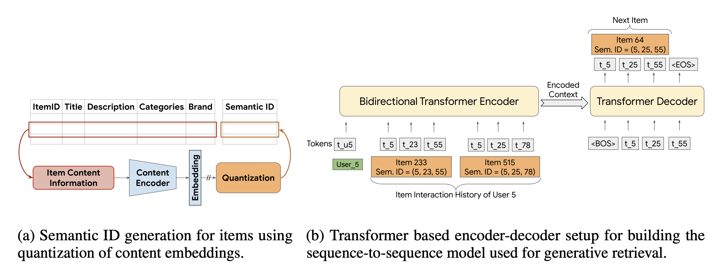

# Semantic Item Representations for Sequential Recommender Systems

## Problem Statement at Glance
Traditional sequential recommenders (e.g., SASRec) treat items as discrete tokens, ignoring rich content features and struggling with cold-start scenarios. While initializing embeddings with content features helps, it fails to capture hierarchical semantic relationships. 

Traditional sequential recommender systems (such as SASRec, BERT4Rec) are based on collaborative information and learn a separate embedding for each item, like for tokens in NLP tasks. 

Meanwhile, in recommender systems we have much more external data than for tokens in NLP, including user and item features and multimodal item representations, including audio, video or text embeddings. The simplest way is to use the external content embeddings to initialize the embedding layer or pass the external embeddings as an input. But is it a best way? 

Recent work on Semantic item representations offers a promising alternative by compressing item features into discrete, interpretable codes compatible with transformer architectures. Try different content representations for sequential recommender systems and assess what works the best in close to reality evaluation scenario.


## Objectives
- Try and compare baseline approaches (SASRec, GPT2) with and without content embedding; 

- Review recent papers exploring the idea of RQ-VAE Semantic IDs, such as:
   - [Recommender Systems with Generative Retrieval](https://arxiv.org/abs/2305.05065)
   - [Better Generalization with Semantic IDs: A Case Study in Ranking for Recommendations](https://arxiv.org/pdf/2306.08121)
   - [Learnable Item Tokenization for Generative Recommendation](https://arxiv.org/abs/2405.07314)
   - [Generating Long Semantic IDs in Parallel for Recommendation](https://arxiv.org/abs/2506.05781)
- Implement RQ-VAE for content embeddings encoding, modify baseline pipeline to work with Semantic IDs
- Try different tokenization techniques and RQ-VAE enhancement
- Optional: Experiment with different content representations, propose your own content embedding fusion techniques or any Semantic IDs enhancements 
- Assess what works the best in unified close to reality evaluation scenario.

## Approach

### Sequential Recommender Systems

Traditional sequential recommender systems rely on collaborative information and learn a separate embedding for each item, similar to how tokens are treated in NLP tasks. These models predict the most relevant next item in a user’s interaction sequence by processing past interactions as an ordered sequence of tokens.



For example, [SASRec (Self-Attentive Sequential Recommendation)](https://arxiv.org/abs/1808.09781) uses a transformer-based decoder to predict the next item in a user's interaction sequence, similar to how GPT-2 predicts the next token in a sentence. 


In fact, GPT-2’s architecture and training objective (next-token prediction) closely resemble SASRec’s next-item prediction task, as both leverage self-attention to capture sequential patterns. This similarity suggests that GPT-2’s architecture can also be adapted for recommendation tasks.

### Content Features for Sequential Recommenders
However, traditional sequential models ignore rich content features (text, images, metadata) and struggling in cold-start scenario. Content includes user and item features and multimodal item representations, such as audio, video or text embeddings. The simplest way is to use the external content embeddings to initialize the embedding layer or pass the external embeddings as an input. The other way is to represent content a number or tokens and learn representations for those tokens.  

### RQ-VAE as a Popular Approach for Semantic Representations Building 
Recent work on Semantic IDs compresses item features into hierarchical discrete codes, enabling efficient, structured and interpretable item representations. 

For example, [RQ-VAE (Residual Quantized Variational Autoencoder)](https://arxiv.org/pdf/2305.05065) compresses item representations by using a multi-stage quantization process:
1. The continuous content vector is encoded into a lower-dimensional space.
2. A quantization step identifies the closest codebook vector from a predefined set.
3. The quantization error is computed and used to find the best-matching vector from the next codebook.
4. This process repeats recursively, with each step refining the residual error from the previous one, resulting in a precise hierarchical representation.
5. The indices of the selected codebook vectors form a Semantic ID, and corresponding vectors are summed to produce a quantized representation. The decoder then reconstructs the original input from this quantized vector.


On top of that, some transformer model is trained on the next-token prediction task, where each element of Semantic ID is treated as a separate token.

The project investigates whether GPT-2, trained for next-token prediction, can effectively generate Semantic IDs for recommendation tasks. By leveraging RQ-VAE to encode items into discrete codes and train GPT-2 to autoregressively predict the next Semantic ID in a sequence, we aim to improve recommendation efficiency, achieving quality comparable with provided baselines.

### Generative Retrieval with Semantic IDs
The codes obtained from RQ-VAE could be used in generative recommendation model for next item prediction as is as in TIGER model (below) or in combination with different tokenization techniques. 




## Evaluation Setup

### Datasets
Start with Amazon Beauty dataset, it is small and popular in recsys research. Use any recsys datasets with content information which you want to try in addition.

The [Amazon Beauty Dataset](https://snap.stanford.edu/data/amazon/productGraph/categoryFiles/reviews_Beauty_5.json.gz) is a widely used dataset that includes customer reviews and ratings for various beauty products on Amazon. It contains information such as reviewer ID, item ID (ASIN), review text, and product rating. For your experiments, it is recommended to use the subset of reviews with ratings higher than 3 (as  a sign of positive interaction).

To generate Semantic IDs, you can utilize the item's metadata provided [here](https://snap.stanford.edu/data/amazon/productGraph/categoryFiles/meta_Beauty.json.gz). (Note: Use the item name and description, not the reviews). 

Also, you can find other Amazon datasets for your experiments [here](https://cseweb.ucsd.edu/~jmcauley/datasets/amazon/links.html).

Another dataset you may use is Zvuk dataset, which contains user listenings of music tracks from the Zvuk streaming service. You can find user interactions and item metadata [here](https://www.kaggle.com/datasets/alexxl/zvuk-dataset).

### Preprocessing
- columns renaming
- N-core or N-filter for items and sequences along with iterative
- removal of consecutive interactions with the same item
- label encoding of users and items, item labels starts with 1 to leave 0 as a padding value

Do not forget to modify the pipeline to do the same labe encoding for items in iteractions and descriptions dataframes. 

### Data splitting

Use global temporal split, take last 10% of interactions into test subset and 10% of the remaining to the validation subset. Use the last holdout item as a target.  

### Model
SASRec model is a baseline recommendation architecture. GPT-2 is very architecturally similar and should have compatative performance. GPT-2 from HuggingFace provides different generation approaches (e.g., gready, beam search) which you can try for generative retriveal with Semantic IDs.

### Metrics
Use popular top-K ranking metrics: Normalized Discounted Cumulative Gain (NDCG@K), 
Mean Reciprocal Rank (MRR@K) and HitRate (HR@K), with K = 5, 10, 20, 50, 100. 

For Semantic IDs you need to evalueate performance on real item ids, but may evaluate performance on each of predicted Semantic IDs. You may, for example, successfully predict the first Semantic ID of an item, and it is also good.

### Pipeline
Proposed pipeline works for model based on collaborative information only. Pay attention and modify the pipeline to properly preprocess items' description on all pipeline steps. 

## Tools & Libraries
See requirements: `requirements.txt`

## Setup Instructions

**Install requirements**:
```bash
pip install -r requirements.txt
```

**Specify environment variables**:

```bash
# data path. Replace with your path if necessary. 
export SEQ_SPLITS_DATA_PATH=$(pwd)/data

# src path
export PYTHONPATH="./"
```

**Create data directories**:

```bash
mkdir $SEQ_SPLITS_DATA_PATH
mkdir $SEQ_SPLITS_DATA_PATH/{raw,preprocessed,splitted}
```

Data folder structure:
- The raw data files are expected in `raw` subdirectory. Move the downloaded raw data .csv files here.
- Data after preprocessing will be placed in the `preprocessed` subdirectory.
- Data after splitting will be placed in the `splitted` subdirectory.

**Download the data**
```bash
cd ./data
wget https://snap.stanford.edu/data/amazon/productGraph/categoryFiles/reviews_Beauty_5.json.gz
wget https://snap.stanford.edu/data/amazon/productGraph/categoryFiles/meta_Beauty.json.gz
```


**Convert the data**
Run `semantic_seqrec/notebooks/parse_beauty_meta.ipynb` to save the data as .csv and rename columns.


**To run dataset preprocessing for a specific dataset, use**:
```bash
# specific dataset
python runs/preprocess.py +dataset=Beauty
```

**Split the selected dataset into training, validation, and test subsets**:

```bash
python runs/split.py split_type=global_timesplit split_params.quantile=0.9 split_params.validation_type=by_time dataset=Beauty
```

Data after splitting will be placed in the `splitted` subdirectory.
See [split.yaml](runs/configs/split.yaml) for possible configuration options.

**Run training, and validation/test metrics computation**:
```bash
python runs/train.py dataset=Beauty split_type=global_timesplit split_subtype=val_by_time quantile=0.9 cuda_visible_devices=0

# or use bash script
bash runs/run_sh/train_model.sh
```

**Run rq_vae algorithm training and validation/test metrics computation**:
```bash
python rq_vae/train_rqvae.py rq_vae/configs/rqvae_amazon.gin 
``` 
or 
```bash
python rq_vae/train_rqvae_early_stopping.py rq_vae/configs/rqvae_amazon.gin 
``` 

Config [train.yaml](runs/configs/train.yaml) 
combines all configurations required for model training and evaluation.


Config [rqvae_amazon.gin](rq_vae/configs/rqvae_amazon.gin) 
combines all configurations required for rq_vae training and evaluation on Amazon Beauty dataset. 

**Dive into dataloaders and generation with GPT-2**
Run `semantic_seqrec/notebooks/training_deep_dive.ipynb`  step-by-step.
